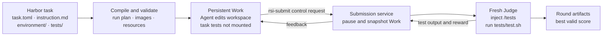

# RSI Harness

RSI Harness is an evaluation framework for Coding Agents tackling
ultra-long-horizon RSI tasks. Agents such as Claude Code and Codex develop
solutions in a persistent, isolated Work container and submit solutions to a
fresh Judge for scoring. They can iterate on test feedback until the submission
limit or timeout, with the highest score retained as the final result.

It natively supports Harbor-format tasks with or without GPUs, from local
single-node Docker runs to supported multi-node clusters.

## Requirements

- Linux with a working `docker` command
- for GPU tasks, NVIDIA GPUs, the NVIDIA Container Toolkit, and a working
  `nvidia-smi` command
- Python 3.12 or 3.13
- permission to manage Docker and the host `DOCKER-USER` and `INPUT` iptables
  chains (usually by running the command with `sudo -E`)
- enough Docker storage for the task image and temporary Judge snapshots
- a supported local Harbor task directory

## Install

Install from a checkout:

```bash
uv tool install /path/to/RSI-Harness
```

Or build and install the wheel:

```bash
uv build
uv tool install dist/rsi_harness-0.1.0-py3-none-any.whl
```

The package includes the run engine and RSI Loop integration. No custom
`PYTHONPATH` is required.

## Configure the Agent

Provide an API key:

```bash
export RSI_AGENT_API_KEY="..."
```

Or reuse an existing Codex or Claude Code login:

```bash
sudo -E "$(command -v rsi-harness)" run /absolute/path/to/task --agent codex --agent-auth local --gpus 4,5
sudo -E "$(command -v rsi-harness)" run /absolute/path/to/task --agent claude-code --agent-auth local --gpus 4,5
```

When using a compatible API proxy, also set its base URL and optionally a
model:

```bash
export RSI_AGENT_API_BASE_URL="https://your-api.example/v1"
export RSI_AGENT_MODEL="your-model"
```

These values are passed only to the Agent process and are redacted from Engine
artifacts. Do not put credentials in the Harbor task directory.

## Run a Harbor task

This mode runs a Harbor task locally with Docker on a single node. For cluster
or multi-node execution, see
[Run multi-node tasks on a cluster](#run-multi-node-tasks-on-a-cluster).

```bash
sudo -E "$(command -v rsi-harness)" run /absolute/path/to/task --gpus 0,1
```

`--gpus` accepts GPU indexes or UUIDs. Work and Judge GPU counts, images,
timeouts, and other runtime settings come from the task. Run
`rsi-harness run --help` for optional controls.

## Run multi-node tasks on a cluster

Below is an example using Blue Vela, an HPC cluster managed by IBM Spectrum
LSF. You can use this integration as a reference to adapt RSI Harness directly
to your own cluster. Preview the resolved job without submitting it:

```bash
uv run rsi-harness run "$TASK" \
  --cluster bluevela \
  --dry-run \
  --agent codex \
  --model gpt-5.6-sol \
  --reasoning-effort xhigh \
  --agent-auth local
```

Remove `--dry-run` to submit the job. GPU counts come from the task; for
multi-node tasks, the adapter maps the Work and Judge requirements to full-node
LSF allocations using the profile's GPUs-per-node setting. `--gpus` is only for
local runs, and `gpus = "all"` needs a numeric cluster override.

To adapt another LSF cluster, copy
`src/rsi_harness/cluster/bluevela/profile.toml`, change its paths and LSF policy,
then pass the new file:

```bash
uv run rsi-harness run "$TASK" --cluster /absolute/path/to/profile.toml ...
```

Cluster mode preserves the native RSI-Harness run and log format. Harbor only
compiles the task format; the adapter never invokes `harbor run`.

## How it works

The input is a supported Harbor task directory containing `task.toml`,
`instruction.md`, `environment/`, and `tests/test.sh`. RSI Harness validates the
task and compiles its images, resources, network policy, and timeouts into one
run plan.



- **Work:** the Agent develops in one persistent container without access to
  the task's `tests/` directory.
- **Submit:** `rsi-submit` sends only a token-scoped control request. RSI Harness
  pauses Work and snapshots its current state; the client does not upload a code
  archive.
- **Judge:** a fresh isolated container receives the snapshot and private tests,
  runs `/tests/test.sh`, records the reward and output, and is then removed.
- **Iterate:** Work resumes with its state intact, so the Agent can use feedback
  and submit again until the submission limit or timeout. The best valid primary
  score, respecting the task's score direction, becomes the final result.

This persistent Work → independent Judge → feedback loop is the long-horizon
RSI mechanism. Codex and Claude Code stop hooks also discourage premature exit,
while durable run state supports safe recovery after interruptions.

The verifier should write a Harbor reward to
`/logs/verifier/reward.json`. A scalar `reward.txt` is also accepted. Use
`--primary-reward NAME` when the reward JSON contains multiple keys and one of
them should determine the best round.

Detailed task-authoring references: `task.toml`
[fields](docs/harbor-task-authoring/task-toml.md) and [Compose, Dockerfile, and
WORKDIR fields](docs/harbor-task-authoring/docker-compose.md).

## View results

The default data and log roots are `.rsi-harness` and `logs`; run artifacts are
written under `logs/runs/RUN_ID`. From the repository root, start the stock
RSI Loop visualizer with:

```bash
rsi-harness visualize
```

Then open `http://127.0.0.1:8000`.

## Recovery and cleanup

Normal multi-round runs manage their own resources. `recover` is only needed
after interruption, a host restart, or an infrastructure failure:

```bash
sudo -E "$(command -v rsi-harness)" recover RUN_ID
```

Omit `RUN_ID` to recover every unfinished recorded run.

A completed run keeps its final Work state as a Docker image, plus a managed
WORKDIR volume when split mode is used. Ordinary cleanup removes leftover
runtime resources but keeps that final state:

```bash
sudo -E "$(command -v rsi-harness)" cleanup RUN_ID
```

Delete the retained final state explicitly when it is no longer needed:

```bash
sudo -E "$(command -v rsi-harness)" cleanup RUN_ID \
  --delete-workspace --yes
```

## Supported task shape

The current Engine supports the common single-service Harbor GPU shape:

- Harbor schema 1.4 on Linux
- one continuous step and one `main` service
- NVIDIA GPU reservations
- one shared task environment
- the standard `tests/test.sh` verifier
- a local Docker build context or prebuilt image

Unsupported or unsafe features are rejected before the Agent starts. Examples
include sidecars, multiple task steps, task-authored Docker volumes, host
networking, privileged containers, arbitrary devices or capabilities, and an
independent verifier image.

The task source directory is never modified. Engine state and logs are written
only below the selected data and log roots.

## Important limitations

- Docker commit captures filesystem changes, not running process state.
- Task-authored Docker or Compose volumes are not supported because their
contents are outside the committed container root filesystem.
- A `/` WORKDIR can produce large Judge snapshots when the Agent writes large
files outside reusable image layers.
- Standard Harbor compatibility runs `test.sh` beside the code under test in
Judge. It isolates Judge from Work, but it is not a separate secret-verifier
protocol.
- The Engine fails closed when required Docker or firewall authority is
unavailable; it does not silently run with weaker isolation.

## Acknowledgements

RSI Harness builds on the excellent work of the following open-source
projects:

- [Harbor](https://github.com/harbor-framework/harbor), which provides the task
  format and core tooling for portable agent environments and evaluation.
- [EdgeBench](https://github.com/ByteDance-Seed/EdgeBench), whose RSI Loop
  powers the agent integration, iterative feedback workflow, and result
  visualization used by RSI Harness.

We thank both teams and their contributors for making their work openly
available.
